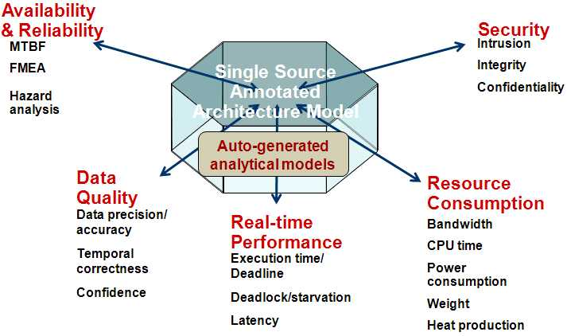

.. AADL documentation master file, created by
   sphinx-quickstart on Wed Mar  7 14:26:16 2018.
   You can adapt this file completely to your liking, but it should at least
   contain the root `toctree` directive.

What is AADL?
=============

Developed by a `SAE International <http://www.sae.org/>`_ sponsored committee of experts, the Architecture Analysis & Design Language (AADL) was approved and published as `SAE Standard <http://standards.sae.org/as5506b/>`_ AS-5506 in November 2004. Version 2.1 of the standard was published in Sept 2012.

The AADL is designed for the specification, analysis, automated integration and code generation of real-time performance-critical (timing, safety, schedulability, fault tolerant, security, etc.) distributed computer systems. It provides a new vehicle to allow analysis of system designs (and system of systems) prior to development and supports a model-based, model-driven development approach throughout the system life cycle.

Benefits of AADL
----------------

The SAE AADL standard can lower development and maintenance costs by

* providing a standard, precise syntax and semantics for performance-critical systems, so that documentation can be well defined
* providing the ability to model large-scale (multi-contractor) architectures from many aspects in a single analyzable model that can be incrementally refined
* capturing the “architectural API” needed to evaluate the effect of change, such as the emergent properties of integration (e.g., safety, schedulability, end-to-end latency, and security)
* allowing early and life-cycle tracking of modeling and analysis
* analyzing the system structure and runtime behavior, complementing functional simulation
* providing a great complement to reference architectures and component-based or product-line development

Actual users and AADL-related projects
--------------------------------------

As an `international industry standard <http://standards.sae.org/as5506b/>`_, AADL enjoys growing acceptance in avionics, aerospace, medical, nuclear, automotive, and robotics communities. You can find out more presentation materials and more details under the wiki section dedicated to the `standardization committee works <https://wiki.sei.cmu.edu/aadl/index.php/Standardization>`_, and all :ref:`publication materials <learning>` related to AADL.

The standardization committee has an active participation from industrial and academic partners, including Adventium Labs, Aerospace, Airbus industries, Boeing, Carnegie Mellon Software Engineering Institute, Chinese Academy of Science, Dassault Aviation, Edgewater, Ellidiss, European Space Agency, Honeywell, INRIA, ISPRAS, ISAE, IRIT, Kansas State University, NASA, Rockwell-Collins, Rolls-Royce, Russian Academy of Science, TELECOM ParisTech, Toyota, U.S Army, University of Pennsylvania. Also, the committee is in active collaboration with other standardization bodies including the `ARINC653 working group <http://www.aviation-ia.com/aeec/projects/apex/>`_, the `SAVI initiative <http://savi.avsi.aero/>`_ and `The Open Group Real-time <http://www.opengroup.org/getinvolved/forums/systems>`_. 

.. _learning:

Learning AADL
=============

Model-Based Engineering with AADL
---------------------------------

Peter Feiler and Dave Gluch authored the book Model-Based Engineering with AADL: An Introduction to the SAE Architecture Analysis & Design Language which covers the basics of the language and the related analysis tools. The book is `available for purchase online <http://www.informit.com/store/model-based-engineering-with-aadl-an-introduction-to-9780321888945>`_ under a hard cover or epub format. 

Software Engineering Institute Resources
----------------------------------------

AADL webinar
^^^^^^^^^^^^

The Software Engineering Institute `has published a webinar on Architecture Analysis with AADL <http://resources.sei.cmu.edu/library/asset-view.cfm?assetID=424907>`_. The presentations introduces the main concepts of the language and also its analysis capabilities to validate resource budgets, latency and safety.

`The webinar is available online <http://resources.sei.cmu.edu/library/asset-view.cfm?assetID=424907>`_ with all the presentation materials: video and slides. 

SEI blogpost articles
^^^^^^^^^^^^^^^^^^^^^

The Software Engineering Institute regularly publishes articles on its `official blog on AADL <http://blog.sei.cmu.edu/>`_. It provides updates and informations about what is new in the language and what is the new tools or research that use the technology.

The articles are available online on the blog under the `AADL category <http://blog.sei.cmu.edu/archives.cfm/category/architecture-analysis-design-language-aadl>`_.

SEI podcasts
^^^^^^^^^^^^

The Software Engineering Institute regularly publishes podcast about AADL. The podcasts feature people from different backgrounds, providing different perspectives about its use in industrial and academic environments.

The podcasts are available on the `SEI podcast series <https://resources.sei.cmu.edu/library/results.cfm?as_q=inmeta:AssetType~Podcast>`_ under the Software Architecture category. They are also available on the `iTunes store under the Software Engineering Institute Podcast Series <https://itunes.apple.com/us/itunes-u/software-engineering-institute/id566573552?mt=10>`_. 

.. toctree::
   :maxdepth: 2
   :caption: Contents:

Indices and tables
==================

* :ref:`genindex`
* :ref:`modindex`
* :ref:`search`
